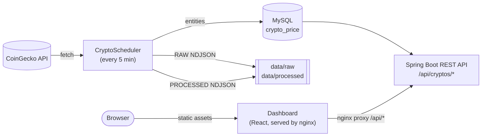
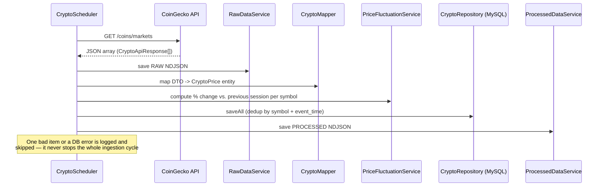
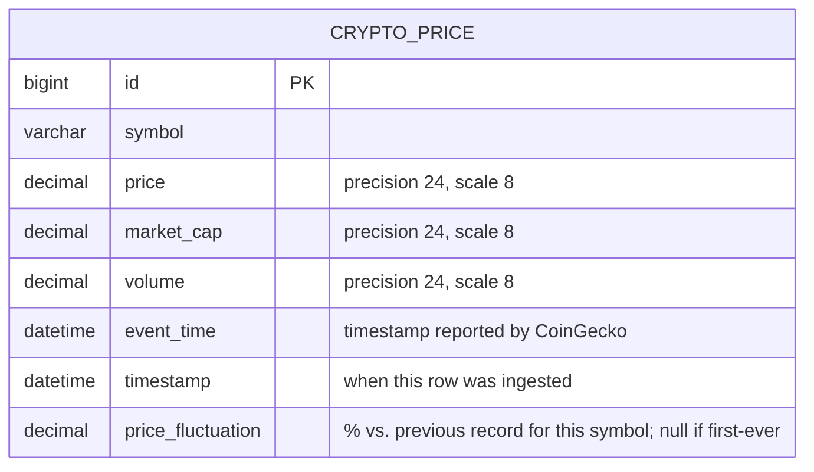

# 🚀 Crypto Data Platform

A scalable **data engineering project** built with **Spring Boot**, designed to ingest, process, and store cryptocurrency market data using a real API — with a React dashboard to visualize it.


---

# 🧠 Overview

This project simulates a **real-world data pipeline**:

```text
API → DTO → Service → Processing → Database + Filesystem
```

It fetches cryptocurrency data from CoinGecko, processes it, stores it in a MySQL database, and also saves raw and processed data locally.

---

# ⚙️ Tech Stack

**Backend**
* Java 17, Spring Boot 3.3, Spring Data JPA, Spring Boot Actuator, Lombok
* MySQL 8, Maven (wrapper)
* REST API (CoinGecko)
* JUnit 5, Mockito, AssertJ, H2 (tests)

**Frontend** (`dashboard/`)
* React 19, Vite, TypeScript
* Recharts (charts), react-router-dom (routing)
* Vitest, React Testing Library (tests)

**Infrastructure**
* Docker & Docker Compose
* nginx (serves the dashboard, proxies `/api/*` to the backend)

---

# 🏗️ Architecture



In Docker Compose, the dashboard's nginx serves the built frontend and proxies `/api/*` to the
backend container, so the browser only ever talks to one origin. In local dev (`npm run dev`),
the Vite dev server and the backend run on different ports, so the backend's CORS config
(`dashboard.cors.allowed-origin`) allows the dev origin directly.

---

# 📂 Project Structure

```text
crypto-data-platform
│
├── client        → API calls
├── controller    → Own REST API (query data, ranking)
├── dto           → API/response objects
├── mapper        → DTO → Entity conversion
├── domain        → Database entities
├── repository    → JPA repositories
├── service       → Business logic (ingestion, fluctuation, ranking)
├── scheduler     → Automated data ingestion
├── data
│   ├── raw       → Raw JSON (NDJSON format)
│   └── processed → Processed data
│
dashboard                 → React + Vite + TypeScript frontend (see dashboard/README.md)
├── src/api        → fetch client (VITE_API_BASE_URL)
├── src/pages      → Overview, History, Ranking views
├── src/components → tables, chart, shared loading/error/empty states
└── src/hooks      → useAsync (loading/error/data)
```

---

# 🔄 Data Flow

1. Fetch data from API
2. Convert DTO → Entity
3. Store RAW data (JSON)
4. Calculate price fluctuation vs. the previous stored record for that symbol
5. Save into MySQL
6. Save processed data



---

# 🐳 Run with Docker (Recommended)

## 1. Build the project

```bash
.\mvnw clean package -DskipTests
```

## 2. Configure credentials (optional)

Copy `.env.example` to `.env` and adjust the values if you don't want the defaults
below. `.env` is git-ignored and read automatically by `docker-compose`.

## 3. Run containers

```bash
docker-compose up --build
```

---

## 🔥 What happens automatically?

* MySQL starts on port **3307**
* Spring Boot app starts on port **8080**
* The dashboard starts on port **5173** (nginx, proxying `/api/*` to the app)
* Scheduler runs and fetches crypto data
* Data is:

    * Saved in DB
    * Saved in `/data/raw`
    * Saved in `/data/processed`

Open the dashboard at **http://localhost:5173**.

---

# 📊 Dashboard

React + Vite + TypeScript frontend under `dashboard/`, visualizing the data ingested by the
pipeline: latest prices per symbol, a price history chart per symbol (with a 7/30/90-day range
picker), and the gain-density ranking.

## Run with Docker

Included automatically in `docker-compose up --build` above — no extra steps.

## Run locally (without Docker)

```bash
# Terminal 1: backend (needs MySQL — see "Run with Docker" above, or point
# application.properties at your own instance)
./mvnw spring-boot:run

# Terminal 2: frontend
cd dashboard
npm install
cp .env.example .env   # VITE_API_BASE_URL=http://localhost:8080
npm run dev
```

Open **http://localhost:5173**. The backend must allow this origin via CORS — the default
`dashboard.cors.allowed-origin=http://localhost:5173` already matches Vite's default port.

## Frontend commands

* Install: `cd dashboard && npm install`
* Dev server: `npm run dev`
* Type-check + build: `npm run build`
* Tests: `npm run test`
* Lint: `npm run lint`

---

# 🗄️ Database

### Connection

Defaults (override via `.env`, see above):

* Host: `localhost`
* Port: `3307`
* Database: `crypto_db`
* User: `cryptouser`
* Password: `crypto123`

---

# 🗂️ Data Model



A single table, `crypto_price`, with a `UNIQUE (symbol, event_time)` constraint — this is what lets
the ingestion pipeline safely re-run without ever inserting the same data point twice.

---

# 🔌 REST API

* `GET /api/cryptos/{symbol}` — full price history for that symbol (newest first), including its
  fluctuation, unbounded. Symbols are matched case-insensitively. Returns an empty list (not a
  404) if the symbol has no data yet.

  ```bash
  curl http://localhost:8080/api/cryptos/btc
  ```

* `GET /api/cryptos/latest` — the most recent snapshot for every known symbol (price, market cap,
  volume, fluctuation). Powers the dashboard's overview.

  ```bash
  curl http://localhost:8080/api/cryptos/latest
  ```

* `GET /api/cryptos/{symbol}/history?from=&to=` — price history for a symbol bounded to a date
  range (ISO-8601, e.g. `2024-01-01T00:00:00`), for the dashboard's chart. Both params are
  optional: defaults to the last 30 days; the range can't exceed 180 days (`400 Bad Request`
  otherwise). Unlike `GET /api/cryptos/{symbol}` above, this is always bounded.

  ```bash
  curl "http://localhost:8080/api/cryptos/btc/history?from=2024-01-01T00:00:00&to=2024-01-31T00:00:00"
  ```

* `GET /api/cryptos/ranking?minSamples=3&limit=10` — ranks all symbols by "gain density": the
  percentage of their recorded fluctuations that were positive (i.e. how consistently a coin goes
  up from one session to the next). `minSamples` (default 3) excludes symbols with too little
  history to be meaningful; `limit` (default 10) caps the result size. Both must be non-negative
  (`400 Bad Request` otherwise).

  ```bash
  curl http://localhost:8080/api/cryptos/ranking
  ```

* `GET /actuator/health` — health check (Spring Boot Actuator), including a `db` component that
  reflects real connectivity to the configured database.

  ```bash
  curl http://localhost:8080/actuator/health
  ```

Validation errors across all endpoints return a consistent JSON body via a global
`@RestControllerAdvice`:

```json
{
  "timestamp": "2024-01-15T10:30:00Z",
  "status": 400,
  "error": "Bad Request",
  "message": "date range must not exceed 180 days",
  "path": "/api/cryptos/btc/history"
}
```

---

# 📁 Data Storage

## RAW Data (NDJSON)

```text
data/raw/crypto_YYYY-MM-DD_HH-mm-ss.json
```

Each line = one crypto record

---

## Processed Data

Stored after transformation for analytics or future pipelines.

---

# ⏱️ Scheduler

The system runs automatically, fetching crypto data every 5 minutes by default.

You can change the frequency via the `crypto.scheduler.fixed-rate-ms` property in
`application.properties` (value in milliseconds), no code changes needed.

---

# 🧪 Notes on Testing

The project has a full unit test suite (JUnit 5, Mockito, AssertJ) that mocks
external dependencies (DB, CoinGecko API), so `./mvnw test` runs without needing
a real database or network access.

`-DskipTests` is used only for the Docker build command above, to keep image
builds fast — tests are expected to be run separately via `./mvnw test`.

---

# 🚀 Features

* Real API integration
* Batch data processing
* Price fluctuation tracking per symbol, session over session
* "Gain density" ranking of the most consistently rising coins
* REST API to query a coin's history and the ranking
* Duplicate handling via DB constraints
* File-based raw data storage
* Interactive React dashboard: latest prices, price history chart, ranking
* Dockerized environment (backend + MySQL + dashboard, one `docker-compose up`)
* Clean architecture (layered)

---

# 🧠 What You Learn From This Project

* Building a data ingestion pipeline
* Working with external APIs
* DTO → Entity mapping
* Handling persistence with JPA
* Using Docker for real environments
* Structuring scalable backend systems

---

# 📌 Future Improvements

* Add Kafka (streaming)
* Add Redis (caching)
* Add integration tests (e.g. Testcontainers against a real MySQL)
* Deploy to cloud (AWS / GCP)

---

# 🤝 Contributors

* **[Iñaki Ramos Iturria](https://github.com/akiramoss)** — project author, as a **data engineering
  + backend learning project**.
* **[Claude Code](https://claude.com/claude-code)** (Anthropic) — AI pair-programmer. Built the
  dashboard end-to-end (bounded REST endpoints, React/Vite/TypeScript frontend, Docker/nginx
  integration) and several backend fixes and refactors; see the commit history
  (`Co-Authored-By: Claude Sonnet 5`) for specifics.

---

# 🏁 Final Status

```text
PRODUCTION-READY BASE PROJECT ✅
```
---

👉 Ready to extend into a real data platform 🚀
